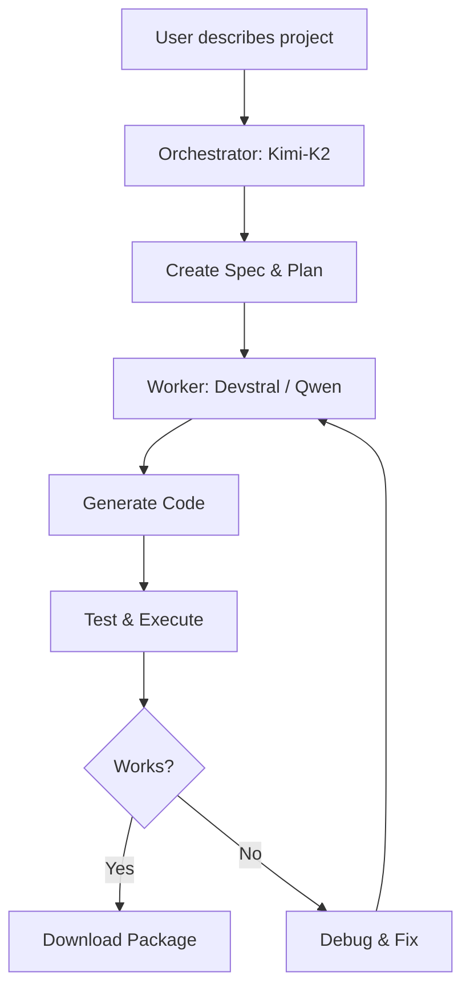
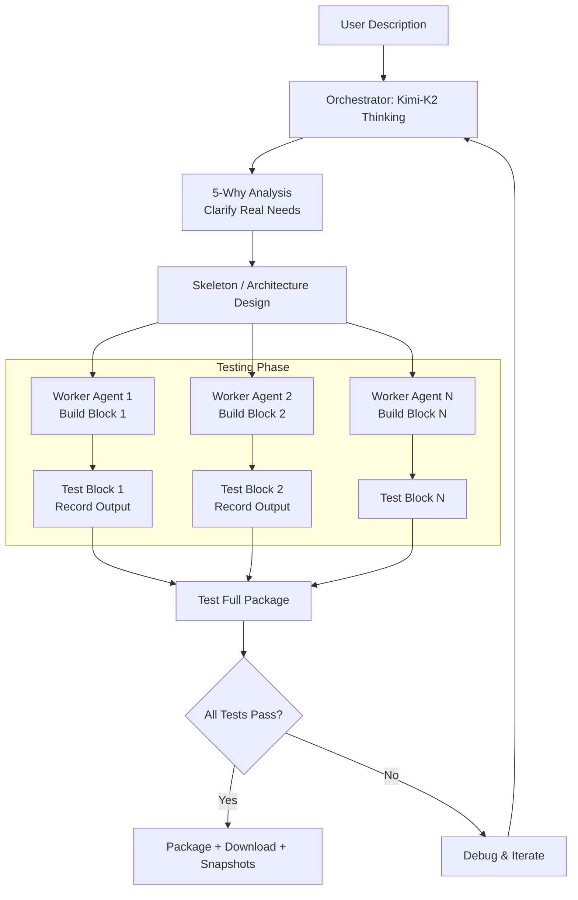
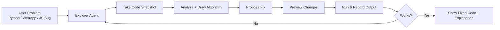

# CodeSmith

  <h1>CodeSmith</h1>
  
<strong>Free Browser-Based AI Code Builder & Troubleshooter</strong> 
  Describe → Spec → Build → Test → Fix → Download

  
  
  

---

## ✨ What is CodeSmith?

**CodeSmith** is a free, open-source web app that turns natural language descriptions into complete, working projects.

You describe what you want (Python programs, web apps, data tools, CLI utilities, or anything custom), and the **multi-agent orchestrator + worker** system handles specification, code generation, automated testing, debugging, iteration, and delivers downloadable code.

**100% in your browser • No installation • No backend server**

## 🚀 Live Demo
**[👉 Open CodeSmith Now](https://khalecl.github.io/codesmith/)**

---

## 🔄 How CodeSmith Works

CodeSmith uses a powerful **multi-agent** architecture with a strong reasoning orchestrator (e.g. Kimi-K2) and specialized worker models.

### 1. Casual Chat → One-Block Tool

### 2. Advanced Multi-Agent Build Mechanism (Main Workflow)

### 3. Troubleshooting & Exploration Mode

---

## Core Capabilities

- **Supported Project Types**:
  - 🐍 Python programs
  - 🌐 Web apps (HTML/JS)
  - 🧹 Data tools (CSV cleaners, analyzers)
  - 📁 CLI tools (file organizers, etc.)
  - ✨ Fully custom projects

- **Agentic Features**:
  - Natural language → detailed spec
  - Multi-agent skeleton design + block building
  - Automated testing & fixing loops
  - Code snapshots, output recording, algorithm diagrams
  - One-click project download

- **Model Flexibility** (OpenAI-compatible):
  - **NVIDIA Free Tier** (Recommended): Kimi-K2 Thinking (orchestrator) + Devstral worker — Best quality
  - **Groq Free Tier**: Fast Llama-4 Maverick + Qwen Coder
  - Bring Your Own Key (Anthropic, OpenAI, local, etc.)

## Quick Start

1. Open the [Live Demo](https://khalecl.github.io/codesmith/)
2. Choose a preset (**NVIDIA** or **Groq** for free use)
3. (Optional) Add your own API key
4. Describe your project or select a template
5. Watch the agents build → Download the result

**Pro tip**: Get free keys from [build.nvidia.com](https://build.nvidia.com) or [console.groq.com](https://console.groq.com)

---

## Tech Stack

- Pure frontend (single `index.html` + GitHub Pages)
- Custom NVIDIA proxy for reliable access
- Any OpenAI-compatible LLM backend
- Modern Tailwind UI + Mermaid diagrams

## Roadmap

- More templates and examples
- Improved multi-file project export (ZIP with structure)
- Better troubleshooting & algorithm visualization
- Future integrations (VS Code extension, etc.)

---

**Made with ❤️ by khalecl**  
**MIT License** — Free for personal and commercial use
